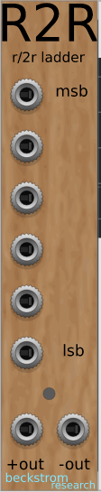
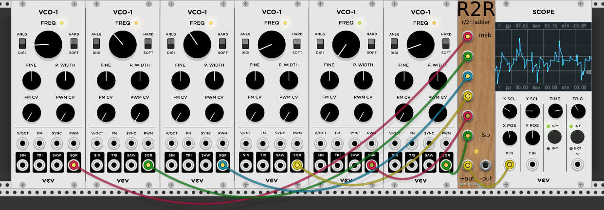
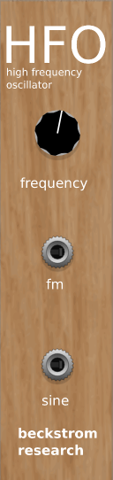
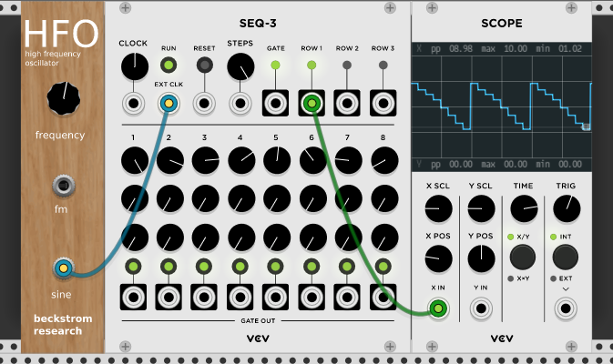
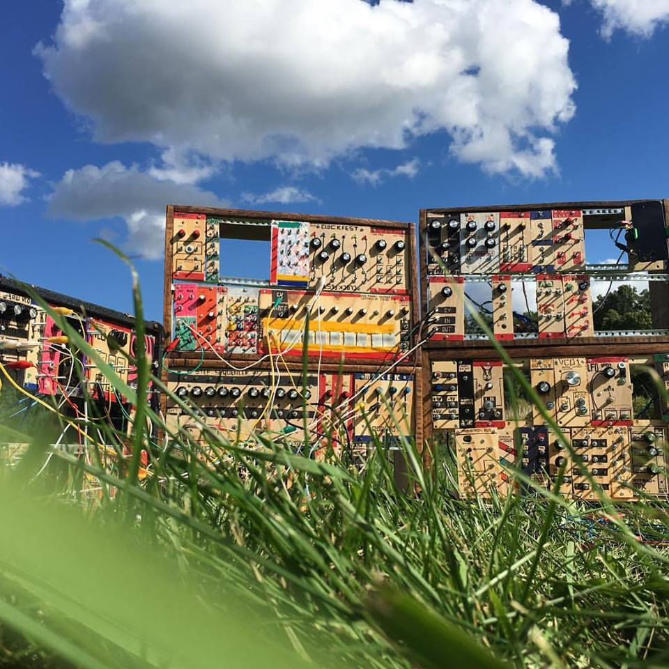

# Beckstrom Research Rack Plugins

Some plugins for the amazing [VCV Rack](https://vcvrack.com). I have coding experience but this is my first real foray into C++.

## R2R Ladder

TL;DR? It's a weighted mixer / digital to analog converter.

_from Wikipedia:_

> An R–2R Ladder is a simple and inexpensive way to perform digital-to-analog conversion, using repetitive arrangements of precise resistor networks in a ladder-like configuration.

If you send a different frequency square wave into each of the 6 inputs, the output will be an analog-ish wave, a combination of the different square waves. In this way, you can take 6 square waves and turn them into a single analog voltage. Of course they don't all have to be square waves, you don't have to have six, etc.

You can also use this module as a simple weighted mixer: the top input will be the loudest, the bottom input the quietest.

For much more info: <https://hackaday.com/2015/11/05/logic-noise-digital-to-analog-with-an-r-2r-dac/>  

# HFO (high frequency oscillator)

One of my favorite things to do is clock sequencers and shift registers at audio speeds and use their output as an oscillator. For instance, if you have a 10-step sequencer, set the first step's voltage to max and then the voltage for each step to a slightly lesser amount, when the sequencer steps through the sequence you'll get a downward stepped saw wave at the output. If you run this at audio speeds (i.e. above 20Hz) you'll get an _audio rate_ stepped saw wave. If you alter the levels of each step, you can create some really interesting and bizarre waveshapes.

Another one of my favorite patches is as follows:

- Clock a shift register with an oscillator (perhaps a HFO), and send to the input any sort of square or gate signal
- Send 6 outputs of the shift register into the R2R module  
- Take the output of the R2R module and send it to audio output or CV input to something. You'll get a stepped analog voltage that changes as fast as the clock

I believe this is how at least part of the Buchla "Source of Uncertainty" module works.

# More info
**I love everything modular!!**

I [built a modular synthesizer from scratch](http://chrisbeckstrom.com/the-modular/) and I'm using some of the modules I built as inspiration for virtual modules... Hence the wood paneling and rough, DIY sensibilities.

There are so many great Rack modules out there, but there are some weird things I have in my DIY synth that I haven't been able to find – such as the R2R ladder in this repo. I hope to continue working on new modules, focusing on emulating some of the circuits I've built for my own system.

# Attribution

These modules use large portions of existing modules:  

- [Befaco](https://github.com/VCVRack/Befaco)  
- [Template](https://github.com/VCVRack/Template)
- [ML Modules](https://github.com/martin-lueders/ML_modules)  

